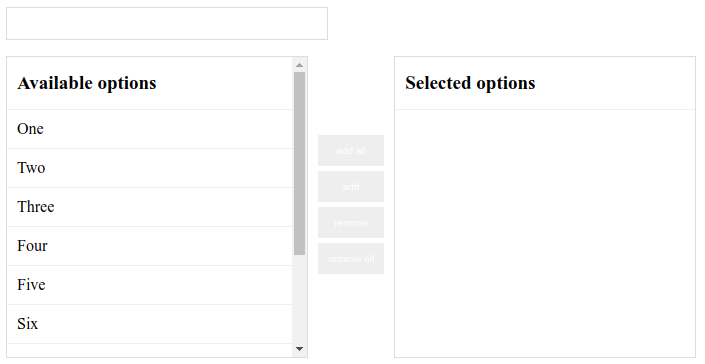
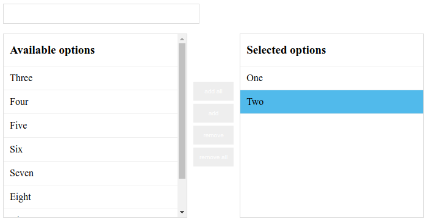

[](https://travis-ci.org/maykinmedia/dual-listbox)
[](https://coveralls.io/github/maykinmedia/dual-listbox?branch=master)
[](https://codeclimate.com/github/maykinmedia/dual-listbox)
[](https://lintly.com/gh/maykinmedia/dual-listbox/)
[](https://github.com/maykinmedia/dual-listbox)
[](https://snyk.io/test/github/maykinmedia/dual-listbox)
[](https://bettercodehub.com/)

[](https://nodei.co/npm/dual-listbox/)

[](https://saucelabs.com/u/jostcrow)

# Dual Listbox

> Make your multi select pretty and easy to use with only javascript. No other frameworks/libraries required.

Styling. (From the stylesheet that can be found in the dist folder)



with selected options and one option highlighted.



## Install

Install with [npm](https://www.npmjs.com/)

```sh
$ npm i dual-listbox --save
```

CDN
```html
<script src="https://cdn.jsdelivr.net/npm/dual-listbox/dist/dual-listbox.min.js"></script>
<link href="https://cdn.jsdelivr.net/npm/dual-listbox/dist/dual-listbox.css">

<!-- for pinned version -->
<script src="https://cdn.jsdelivr.net/npm/dual-listbox@1.0.9/dist/dual-listbox.min.js"></script>
<link href="https://cdn.jsdelivr.net/npm/dual-listbox@1.0.9/dist/dual-listbox.css">
```

## Usage

```javascript
let dualListbox = new DualListbox('select'); // Selects the first selectbox on the page.
let dualListbox = new DualListbox('.select'); // Selects the first element with the class 'select'
let dualListbox = new DualListbox('#select'); // Selects the first element with the id 'select'

let select = document.querySelector('#select');
let dualListbox = new DualListbox(select); // Add a HTMLElement
```

You can also pass some options to the DualListbox

```javascript
let dualListbox = new DualListbox('#select', {
    addEvent: function(value) { // Should use the event listeners
        console.log(value);
    },
    removeEvent: function(value) { // Should use the event listeners
        console.log(value);
    },
    availableTitle: 'Different title',
    selectedTitle: 'Different title',
    addButtonText: '>',
    removeButtonText: '<',
    addAllButtonText: '>>',
    removeAllButtonText: '<<',

    options: [
        {text:"Option 1", value: "OPTION1"},
        {text:"Option 2", value: "OPTION2"},
        {text:"Selected option", value: "OPTION3", selected:true}
    ]
});

dualListbox.addEventListener('added', function(event){
    console.log(event);
    console.log(event.addedElement);
});
dualListbox.addEventListener('removed', function(event){
    console.log(event);
    console.log(event.removedElement);
});
```

Try it online on [JSFiddle](https://jsfiddle.net/pn2zcwre/3/).

## Exposed elements

All the elements should be exposed. This way it should be possible to add custom attributes to the element of choice.

```javascript
let dualListbox = new DualListbox('#select');

// Access the buttons:
dualListbox.add_button.setAttribute('a', 'a');
dualListbox.add_all_button.setAttribute('a', 'a');
dualListbox.remove_button.setAttribute('a', 'a');
dualListbox.remove_all_button.setAttribute('a', 'a');

// Access the search field:
dualListbox.search.classList.add('some_class');

// Access the list containers:
dualListbox.selectedList.setAttribute('a', 'a');
dualListbox.availableList.setAttribute('a', 'a');
```

## Contributing

Pull requests and stars are always welcome. For bugs and feature requests, [please create an issue](https://github.com/maykinmedia/dual-listbox/issues).

## Author

**Maykin Media**

* [maykinmedia.nl](https://www.maykinmedia.nl/)
* [github/maykinmedia](https://github.com/maykinmedia)
* [twitter/maykinmedia](http://twitter.com/maykinmedia)

## License

Copyright © 2019 [Maykin Media](https://www.maykinmedia.nl/)
Licensed under the MIT license.
